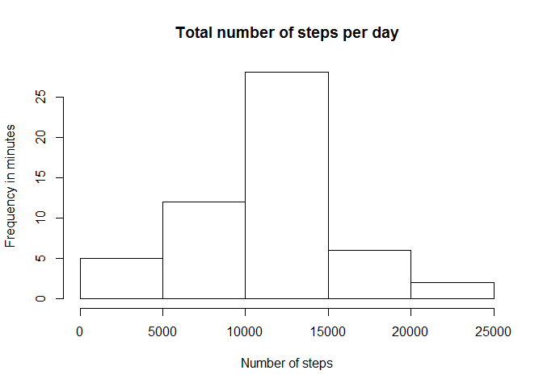

Reproducible Research
=====================


Assessment 1 - Introduction
---------------------------


It is now possible to collect a large amount of data about personal movement using activity monitoring devices such as a Fitbit, Nike Fuelband, or Jawbone Up. These type of devices are part of the "quantified self" movement - a group of enthusiasts who take measurements about themselves regularly to improve their health, to find patterns in their behavior, or because they are tech geeks. But these data remain under-utilized both because the raw data are hard to obtain and there is a lack of statistical methods and software for processing and interpreting the data.

This assignment makes use of data from a personal activity monitoring device. This device collects data at 5 minute intervals through out the day. The data consists of two months of data from an anonymous individual collected during the months of October and November, 2012 and include the number of steps taken in 5 minute intervals each day.


####Loading the data


```r
dataFrame <- read.csv("./data/activity.csv", header = TRUE)
```


####What is mean total number of steps taken per day?


*Calculate the total number of steps taken per day*


```r
stepsPerDay <- aggregate(steps ~ date, data = dataFrame, sum, na.rm=TRUE)
```

*Make a histogram of the total number of steps taken each day*


```r
hist(stepsPerDay$steps, main="Total number of steps per day", xlab="Number of steps", ylab= "Frequency in minutes", plot=TRUE)
```

 
